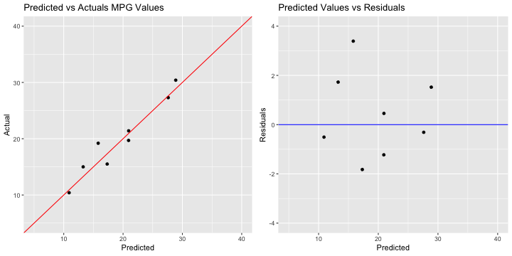

## Make Your Own Model App: Introduction

As a student who has taken the majority (if not all) of the courses in the Data Science Specialization track, by now you have probably grown an appreciation for how nuanced and sometimes difficult it can be to build the perfect predictive model. 

Even if you've mastered the skill of building the models themselves, chances are that your model could be even more accurate. What if you picked the wrong variables to use as predictors? What if you used the wrong algorithm? Depending on the problem, you'll probably be able to narrow down the set of choices somewhat. But it will most likely still be unclear as to which combination will yield the most optimal result.

Wouldn't it be nice if there was some sort of app that could help automate this process? That is exactly what the "Make Your Own Model" app is here for! 

This app simplifies the model creation process by making it easy to include/exclude variables and change the type of algorithm being used. The app then outputs two plots and a calculation to help you assess the accuracy of the model you made. You can then easily adjust your choices and try again.

--- .class #id 

## Make Your Own Model App: How To Use It

For the sake of simplicity, I have chosen to limit the scope of my app to just predicting the `mpg` variable in the `mtcars` dataset. Here's how it works:

1. Select the type of algorithm you would like to use for prediction

2. Check the boxes of the predictors that you would like to include. You can select as many or as few as you like- however, if none are selected then the app will request that you select at least one predictor.

3. View the output and analyze your results. 

    i) The app will output two plots: a plot of the predicted versus actual `mpg` values, and a plot of the predicted `mpg` values versus their residuals.
    
    ii) The app will also output the root mean squared error (RMSE) of the model. This indicates the absolute fit of the model to the data.
    
4. Adjust your inputs again to see what choices yield the best results!


--- .class #id 

## Make Your Own Model App: Example

Here is an example of the plots the app would output for a linear regression model that uses Number of Cylinders, Gross Horsepower, and Weight (per 1000lbs) as predictors:



And this is what the app would calculate for the root mean squared error (RMSE):

```
## [1] 1.665536
```

--- .class #id 

## Make Your Own Model App: Future Development

This app was limited to predicting the `mpg` variable using the `mtcars` dataset, but I think it would be possible to expand upon this. 

The next iteration of the app could have the user choose which variable in the dataset they would like to be the outcome, instead of being forced to use `mpg`, and then leave the remaining variables to be used as potential predictors.

I would also like to have this app work for any dataset that the user has chosen. However, I do think this would be much more difficult to implement because the app would have to be able to anticipate many forms of untidy data. The app would have to have some sort of standardized data preparation so that once it passes through the this process, the model will be able to use the data no matter what format the dataset was in originally. Or maybe the app would only take in datasets of a specific form- for instance, only CSV files. 

Either way, I would like to expand upon this app's capabilities in the future.


